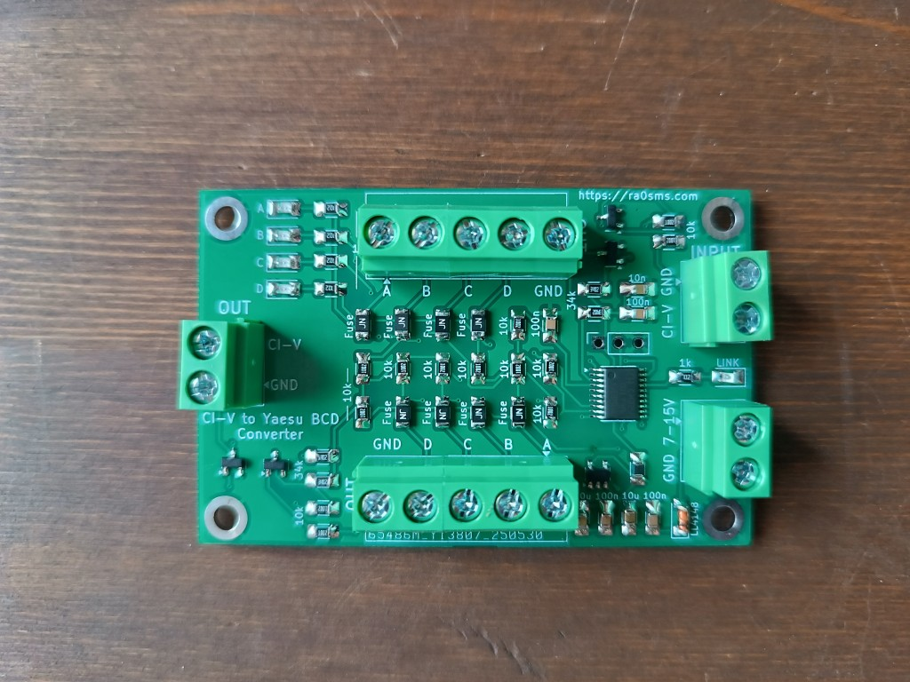
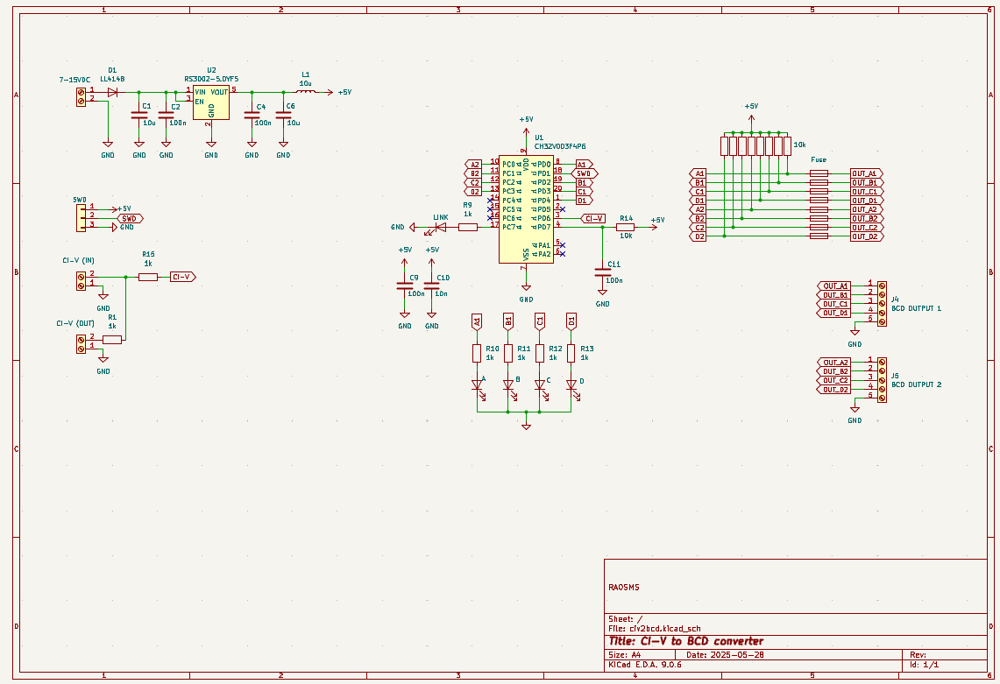

## Converter Icom CI-V to Yaesu BCD band data

PCB dimensions: 70*45 mm

Power supply: 7-15VDC (20mA)

Baud rate: 9600 kb/s

2 separated Yaesu BCD outputs

1 Icom CI-V output

More information - https://ra0sms.com/civ2bcd

